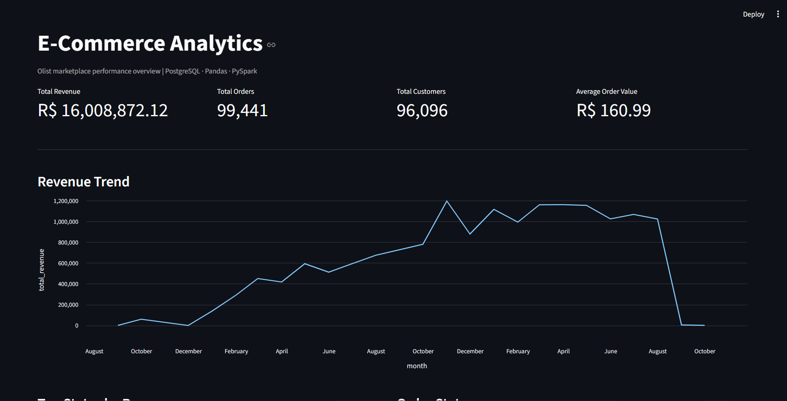
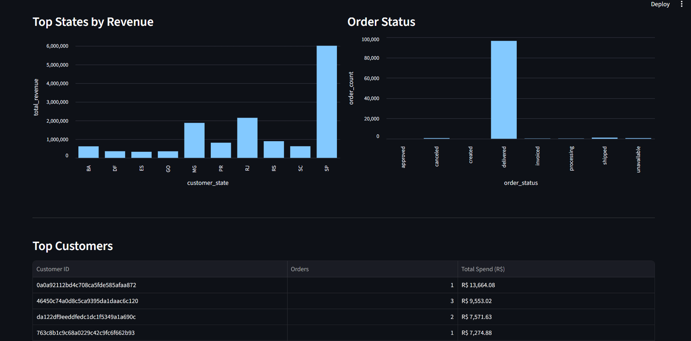

# E-Commerce Data Pipeline

A data engineering project that processes the Olist e-commerce dataset through a complete pipeline using Pandas, PostgreSQL, PySpark, automated testing, and a Streamlit analytics dashboard.

## Project Overview

The pipeline reads raw Olist e-commerce CSV files, cleans and validates the data, transforms it into analytics-ready datasets, loads the transformed data into PostgreSQL, and provides SQL queries and an interactive dashboard for analysis.

A PySpark implementation of the transformation logic is also included and verified against the Pandas implementation.

## Dashboard Preview

The project includes a Streamlit dashboard connected to PostgreSQL, providing an interactive view of key e-commerce metrics and analytics.

### Overview



### Analytics



## Architecture

```text
Raw CSV Data
     │
     ▼
Ingestion
     │
     ▼
Cleaning
     │
     ▼
Validation
     │
     ├──────────────► Pandas Transformation
     │                       │
     │                       ▼
     │                PostgreSQL Loader
     │                       │
     │                       ▼
     │                PostgreSQL Tables
     │                       │
     │                       ▼
     │                Analytics SQL
     │                       │
     │                       ▼
     │              Streamlit Dashboard
     │
     └──────────────► PySpark Transformation
                             │
                             ▼
                     Output Verification
                     against Pandas
```

## Technologies Used

- Python
- Pandas
- PostgreSQL
- SQLAlchemy
- psycopg2
- PySpark
- Java 17
- Pytest
- Streamlit

## Dataset

This project uses the Olist Brazilian E-Commerce dataset.

The pipeline reads the following six raw datasets:

- Customers
- Orders
- Order Items
- Order Payments
- Products
- Product Category Name Translation

## Project Structure

```text
ecommerce-data-pipeline/
│
├── data/
│   └── raw/
│
├── sql/
│   ├── schema.sql
│   └── analytics.sql
│
├── src/
│   ├── ingestion.py
│   ├── cleaning.py
│   ├── validation.py
│   ├── transformation.py
│   ├── postgres_loader.py
│   ├── spark_transform.py
│   ├── main.py
│   └── dashboard.py
│
├── tests/
│   ├── test_transformation.py
│   ├── test_validation.py
│   └── test_spark_transform.py
│
├── .gitignore
├── PROJECT_CONTEXT.txt
├── requirements.txt
└── README.md
```

## Pipeline Steps

### 1. Ingestion

`ingestion.py` reads the raw CSV files and returns them as Pandas DataFrames.

### 2. Cleaning

`cleaning.py` performs data cleaning, including:

- Converting timestamp columns to datetime
- Handling missing product categories
- Preparing the raw datasets for validation

### 3. Validation

`validation.py` validates data quality and relationships, including:

- Non-null checks for key columns
- Uniqueness checks
- Referential integrity checks
- Negative value checks
- Payment installment validation

The validation step raises a `ValueError` if a check fails.

### 4. Pandas Transformation

`transformation.py` creates five analytics-ready DataFrames.

#### `dim_customers`

One row per customer.

Columns:

- `customer_unique_id`
- `customer_city`
- `customer_state`

#### `dim_products`

One row per product.

Columns:

- `product_id`
- `product_category_name_english`

#### `fact_orders`

One row per order.

Columns:

- `order_id`
- `customer_unique_id`
- `order_purchase_timestamp`
- `order_status`
- `item_count`
- `product_value`
- `freight_value`
- `payment_value`

Order items and payments are aggregated separately before joining to prevent row multiplication.

#### `monthly_sales`

Monthly sales metrics.

Columns:

- `month`
- `order_count`
- `product_revenue`
- `freight_revenue`
- `total_revenue`
- `average_order_value`

#### `customer_metrics`

Customer-level metrics.

Columns:

- `customer_unique_id`
- `total_orders`
- `total_spend`
- `first_purchase_date`
- `last_purchase_date`

### 5. PostgreSQL

The PostgreSQL schema is defined in:

```text
sql/schema.sql
```

The pipeline creates the following tables:

- `dim_customers`
- `dim_products`
- `fact_orders`
- `monthly_sales`
- `customer_metrics`

The PostgreSQL loader uses environment variables for database configuration:

```text
DB_HOST
DB_PORT
DB_NAME
DB_USER
DB_PASSWORD
```

Example PowerShell configuration:

```powershell
$env:DB_HOST="localhost"
$env:DB_PORT="5432"
$env:DB_NAME="ecommerce_analytics"
$env:DB_USER="postgres"
$env:DB_PASSWORD="your_password"
```

Load the transformed data:

```powershell
python -c "from src.postgres_loader import load_to_postgres; print(load_to_postgres())"
```

### 6. Pipeline Entry Point

`src/main.py` provides a single entry point for running the pipeline.

Run:

```powershell
python -m src.main
```

This runs the pipeline and loads the transformed datasets into PostgreSQL.

### 7. Analytics Queries

`sql/analytics.sql` contains five analytical queries:

1. Monthly revenue trend
2. Top 10 customers by total spend
3. Top customer states by total revenue
4. Order status distribution
5. Average order value by month

### 8. PySpark Transformation

`spark_transform.py` implements the same transformation logic using PySpark.

It produces the same five outputs as the Pandas transformation:

- `dim_customers`
- `dim_products`
- `fact_orders`
- `monthly_sales`
- `customer_metrics`

The Spark output was verified against the Pandas output.

### 9. Automated Tests

The project includes automated tests for:

- Pandas transformation outputs
- Unique order and customer identifiers
- Expected output columns
- Data validation checks
- Referential integrity checks
- Invalid negative values
- Spark and Pandas row-count consistency
- Spark and Pandas aggregate-total consistency

Run all tests with:

```powershell
python -m pytest -v
```

Current result:

```text
13 passed
```

### 10. Streamlit Dashboard

`src/dashboard.py` provides an interactive analytics dashboard backed by PostgreSQL.

The dashboard displays:

- Total revenue
- Total orders
- Total customers
- Average order value
- Monthly revenue trend
- Revenue by customer state
- Order status distribution
- Top 10 customers by total spend

Start the dashboard with:

```powershell
streamlit run src/dashboard.py
```

## Verification Results

Pandas and PySpark produced matching row counts:

| Dataset | Rows |
|---|---:|
| `dim_customers` | 96,096 |
| `dim_products` | 32,951 |
| `fact_orders` | 99,441 |
| `monthly_sales` | 25 |
| `customer_metrics` | 96,096 |

`fact_orders` was also verified to contain unique `order_id` values.

Aggregate totals between Pandas and PySpark matched, with only negligible floating-point precision differences.

## Setup

### 1. Create and activate a virtual environment

```powershell
python -m venv .venv
.\.venv\Scripts\Activate.ps1
```

### 2. Install dependencies

```powershell
pip install -r requirements.txt
```

### 3. Install PostgreSQL and create the database

Create the database:

```sql
CREATE DATABASE ecommerce_analytics;
```

Run the schema:

```powershell
& "D:\Program Files\PostgreSQL\18\bin\psql.exe" -U postgres -d ecommerce_analytics -f sql\schema.sql
```

### 4. Configure database environment variables

Set:

```text
DB_HOST
DB_PORT
DB_NAME
DB_USER
DB_PASSWORD
```

### 5. Run the pipeline

```powershell
python -m src.main
```

## Running Individual Transformations

### Pandas

```powershell
python -c "from src.transformation import transform_data; data = transform_data(); print({name: df.shape for name, df in data.items()})"
```

### PySpark

```powershell
python -c "from src.spark_transform import spark_transform_data; data = spark_transform_data(); print({name: df.count() for name, df in data.items()})"
```

### Tests

```powershell
python -m pytest -v
```

### Dashboard

```powershell
streamlit run src/dashboard.py
```

## Future Improvements

- Add Docker support
- Add orchestration for scheduled pipeline execution
- Add CI/CD for automated testing
- Add incremental data loading
- Deploy the dashboard
